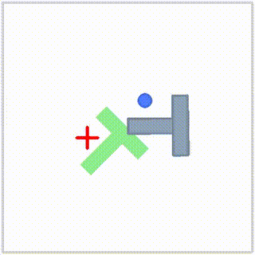
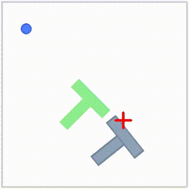
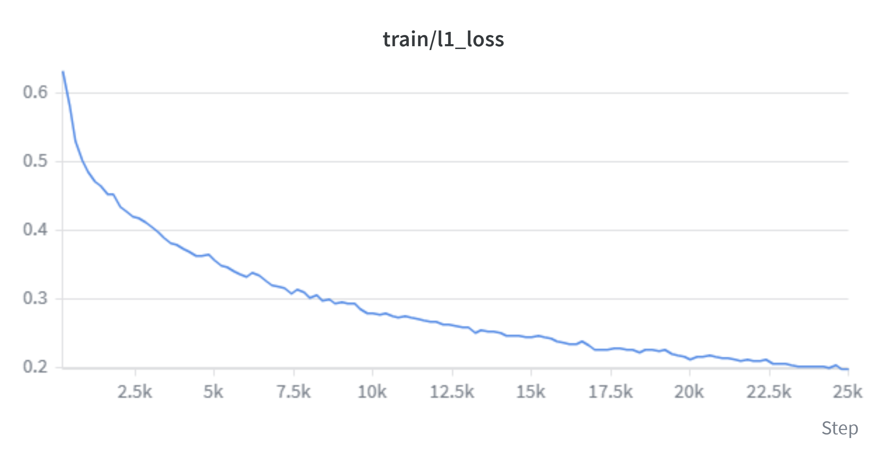
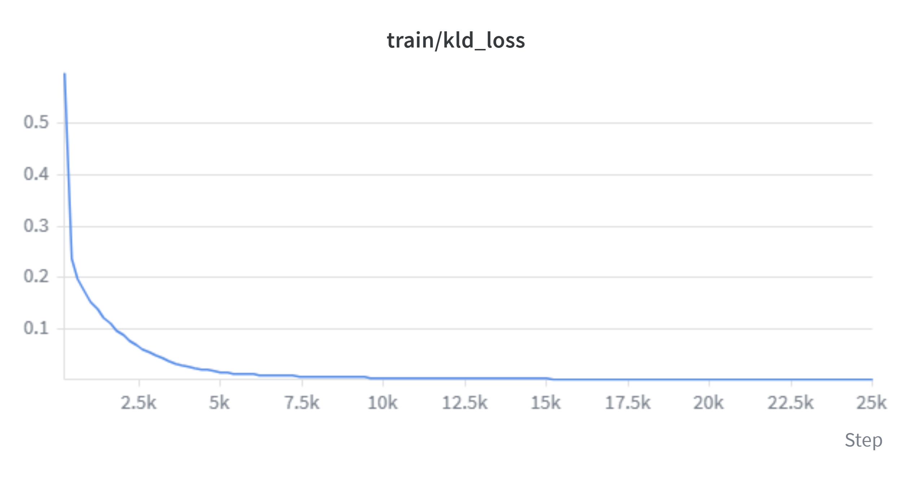

# ACT on PushT: A First Behavioral Cloning Policy

LeRobot의 ACT(Action Chunking with Transformers) 정책을 `lerobot/pusht` 데이터셋으로 학습하고 gym-pusht 시뮬레이터에서 평가한 로보틱스 모방학습 입문 프로젝트다. 25,000 스텝(7.8 epoch) 학습 후 50 에피소드 평가에서 `pc_success` 0.0%, `avg_max_reward` 0.369를 기록했다. 이 저장소의 목적은 높은 성공률이 아니라, 데이터 로딩부터 학습·평가·영상 생성까지 end-to-end로 재현 가능하게 만드는 것과 실패 원인을 분석하는 것이다. 성공 판정 임계치(겹침 95%)는 넘지 못했으나 목표와 약 37% 겹치는 수준까지 블록을 밀었다. 추론 파라미터 변경과 학습량 8배 증대라는 두 가지 개선 시도가 모두 실패했고, 이 과정에서 병목이 학습량이 아니라 전문가 시연에는 없는 오류 상태에서의 복구 능력에 있음을 확인했다.

| 가장 잘된 에피소드 (max_reward 0.85) | 실패 에피소드 (max_reward 0.00) |
| --- | --- |
|  |  |

---

## Setup

```bash
conda create -n lerobot python=3.11 -y && conda activate lerobot
git clone https://github.com/huggingface/lerobot && cd lerobot
pip install -e ".[pusht,training]"
```

환경 검증:

```bash
python -c "import gym_pusht, torch; print(torch.__version__, torch.cuda.is_available())"
```

**본 프로젝트 실행 환경**

| | |
| --- | --- |
| OS | WSL2 (Ubuntu) on Windows |
| Python | 3.11 |
| PyTorch | 2.11.0+cu130 |
| GPU | NVIDIA GeForce RTX 4060 Ti (VRAM 8 GB) |
| LeRobot commit | `6adf5151` |

---

## Data

Dataset: `lerobot/pusht`

```python
from lerobot.datasets.lerobot_dataset import LeRobotDataset
ds = LeRobotDataset("lerobot/pusht")
```

| Key | Shape | dtype | 의미 |
| --- | --- | --- | --- |
| `observation.state` | `(2,)` | `float32` | 에이전트 2D 위치 |
| `observation.image` | `(3, 96, 96)` | `float32` | top-down RGB (channel-first) |
| `action` | `(2,)` | `float32` | 목표 2D 위치 |

- Episodes: 206
- Total frames: 25,650
- 에피소드당 평균 프레임: 약 124 (에피소드마다 길이가 다르다)
- Control frequency: 10 Hz

**Task**: T자 블록을 목표 구역으로 밀어 넣는 것. 에피소드는 목표 구역과의 최대 겹침이 **95% 이상**에 도달했을 때 성공으로 집계된다.

---

## Method

ACT (Zhao et al., 2023)는 단일 관측으로부터 행동을 하나씩 예측하는 대신 미래 k개 행동의 chunk를 예측한다. chunk로 k개를 한 번에 예측하니 정책이 내려야 하는 결정 횟수가 k분의 1로 줄고 그래서 매 스텝 오차가 쌓이는 BC의 문제가 덜해진다. 정책은 conditional VAE로 학습되며 style latent "z"가 학습 중 사람 시연의 다양함을 담아두고 추론 시에는 0으로 고정되어 롤아웃이 결정론적이 된다. 손실은 L1손실과 KL 항 두 개로 구성된다.

아키텍처: ResNet-18 (vision backbone) → transformer encoder → transformer decoder → (chunk_size, action_dim). 총 파라미터 약 52M.

### Hyperparameters

| Parameter | Value | Note |
| --- | --- | --- |
| `chunk_size` | 100 | LeRobot default |
| `n_action_steps` | 100 | default (chunk 전체를 실행 후 재예측) |
| `kl_weight` (β) | 10.0 | default |
| `optimizer_lr` | 1e-5 | default, 고정 (scheduler 미적용) |
| `batch_size` | 8 | VRAM 8GB 기준 보수적 설정 |
| `steps` | 25,000 | 7.8 epochs × 3,206 steps/epoch |
| `vision_backbone` | resnet18 | |
| `temporal_ensemble_coeff` | `null` | 미사용 (baseline) |
| `seed` | 1000 | |

**steps를 25,000으로 정한 근거**: LeRobot의 Compute Hardware Guide는 로보틱스 모방학습이 수십만 스텝이 아니라 데이터셋 기준 5~10 epoch에서 수렴한다고 가이드 되어있다. steps_per_epoch = 25,650 / 8 = 3,206이므로 50,000 스텝은 15.6 epoch(가이드 기준 2배 초과)이고 25,000 스텝은 7.8 epoch(가이드 기준 중앙)이다. 그중 작은 쪽을 택했고 학습 중 train 지표로 계산을 검증했다. 이 판단은 아래 학습량 증대 실험에서 타당함이 확인된다.

### Reproduce training

```bash
lerobot-train \
  --policy.type=act \
  --dataset.repo_id=lerobot/pusht \
  --env.type=pusht \
  --policy.device=cuda \
  --steps=25000 --batch_size=8 \
  --save_freq=5000 --env_eval_freq=5000 \
  --eval.n_episodes=10 --eval.batch_size=1 \
  --output_dir=outputs/train/act_pusht_v1 \
  --seed=1000
```

학습 소요 시간: **약 21분** (약 19.7 step/s, VRAM 2.5GB / GPU-Util 69~79%)

### Reproduce evaluation

```bash
lerobot-eval \
  --policy.path=outputs/train/act_pusht_v1/checkpoints/025000/pretrained_model \
  --env.type=pusht \
  --eval.n_episodes=50 --eval.batch_size=1 \
  --output_dir=outputs/eval/final_50ep
```

Trained policy: https://huggingface.co/hersis0219/act_pusht_v1

---

## Results

### Final evaluation (50 episodes)

| Metric | Value |
| --- | --- |
| `pc_success` | **0.0 %** |
| `avg_max_reward` | **0.369** (range 0–1) |
| `avg_sum_reward` | **30.611** |

"avg_max_reward"는 각 에피소드에서 도달한 최대 정답목표 겹침의 평균. 따라서 이 값이 0보다 충분히 크면서 "pc_success"가 0에 가깝다는 것은 정책이 목표 근처까지는 계속해서 접근하지만 95% 임계치를 넘지 못한다는 뜻이다.
에피소드별 편차가 컸다(최고 0.850, 최저 0.000).

**참고 기준선**과의 비교: "lerobot/diffusion_pusht"는 500 에피소드 평가에서 평균 최대 겹침 0.955, 성공률 65.4%를 기록한다. 단 이는 다른 정책(Diffusion Policy), batch 64 × 175,000 스텝으로 총 학습 샘플이 훨씬 큰 모델이다. 또한 그 기준선조차 평균 겹침 0.955에서 성공률이 65.4%에 머문다는 점은 95% 임계치가 상당히 엄격함을 보여준다.

https://huggingface.co/lerobot/diffusion_pusht

### Training curves




l1_loss는 0.62에서 0.212까지 발산이나 정체 없이 꾸준히 감소했다. kld_loss는 0.45에서 시작해 약 6,000 스텝에서 0.10, 17,000 스텝에서 0.002, 최종 0.001까지 떨어졌다. KL 항이 사실상 0으로 수렴한 것은 posterior collapse(CVAE의 style latent z가 실질적으로 사용되지 않는 상태)이다. 다만 l1_loss 감소와 reward 상승이 함께 관찰되었으므로 학습자체는 정상 진행됐다.

### Ablation 1: temporal ensemble + `n_action_steps`

| Setting | `n_action_steps` | `temporal_ensemble_coeff` | `avg_max_reward` | `pc_success` |
| --- | --- | --- | --- | --- |
| baseline | 100 | `null` | **0.418** | 0.0 % |
| variant | 1 | 0.01 | **0.280** | 0.0 % |

두 행은 동일 체크포인트와 동일한 20개 평가 에피소드를 사용하며 추론 파라미터만 다르므로 재학습이 필요하지 않았다. "temporal_ensemble_coeff"를 사용하려면 매 스텝 추론이 필요하여 "n_action_steps=1"이 강제되므로, 두 변경은 별개 실험이 아니라 한 세트다.

결과는 **33% 성능 하락**. 해석은 실패 분석 2번에 있다.

### Ablation 2: 학습량 증대

| Setting | `batch_size` | `steps` | epochs | `l1_loss` | `avg_max_reward` |
| --- | --- | --- | --- | --- | --- |
| v1 (baseline) | 8 | 25,000 | 7.8 | 0.212 | **0.418** |
| v2 | 32 | 50,000 | 62 | **0.106** | **0.379** |

총 학습 샘플이 200,000 → 1,600,000으로 8배 증가하고 l1_loss는 절반이 되었으나, 실제 추론 성능은 오히려 하락했다. 학습 중 평가에서 avg_sum_reward는 40,000 스텝에서 42.84로 정점을 찍은 뒤 50,000 스텝에서 26.06으로 떨어졌다. l1_loss가 계속 감소하는 동안 평가 성능이 하락한 것은 overfitting의 전형적 모습이며, early stopping의 필요성을 보여준다. 대표 모델로는 v1을 유지했다.

---

## Failure analysis

정책이 실패한 세 가지 지점과 그 원인에 대한 진단

**1. 목표에 도달했는데 멈추지 못함**

- **Observed**: ep2는 max_reward가 0.85로 20개 중 가장 높았다. 영상을 보니 어느순간 T블록을 목표에 거의 맞췄는데, 그 다음에 크게 움직여서 목표에서 이탈했다. 근데 sum_reward는 43.4로 중간밖에 안 됐다.
- **Hypothesis**: max는 1등인데 sum이 중간이라는 게 "잠깐 맞췄다가 유지를 못 했다"는 뜻인 것 같다.
- **Evidence**: ep0과 비교하면 확실하다. ep0은 max가 0.477로 중간인데 sum은 98.6으로 20개 중 최고였다. 영상을 보니 ep0도 큰 움직임이 있었는데, 그게 T블록을 밀 때가 아니라 agent가 위치 잡으러 돌아갈 때였다. 접촉 중에는 블록을 안 흔들어서 목표 근처에 계속 있었다. 반대로 ep2는 접촉 중에 크게 움직여서 이탈했다. 결국 움직임이 큰게 문제가 아니라 접촉 중에 큰 움직임이 나오는게 문제인 것 같다.
- **Next**: 멈추는 동작을 어떻게 학습시킬지는 아직 모르겠다. 일단 학습 데이터에 목표에 맞춘 뒤 정지하는 구간이 충분히 있는지 확인해보고 싶다.

**2. 추론 주기를 줄여도 복구하지 못함**

- **Observed**: 기존에 temporal ensemble이 작동하지 않은 ep2와 비교한 결과, 이번 건 비슷하게 이탈하는데 좀 더 천천히 이탈하고 이탈한 후에도 계속 접촉하며 구석으로 미는 경향이 있다.
- **Hypothesis**: 아마 부정확한 모델로 매 1스텝마다 가중평균값으로 예측하려니 관성적으로 부정확한 값이 나온 것 같다.
- **Evidence**: avg_max_reward 0.418 → 0.280 (33% 하락). 그리고 ep2 max_reward도 0.851 → 0.733.
- **Next**: 이때는 모델을 overfitting이 안 생기는 한에서 더 train 시켜야 한다고 생각했다. 그래서 실제로 학습량을 8배 늘려봤는데(실패 3번), 오히려 성능이 떨어졌다.

**3. 학습량을 8배 늘렸는데 오히려 나빠짐**

- **Observed**: batch 8→32, steps 25,000→50,000으로 절대적인 학습량을 늘려봤다(총 학습 샘플 200,000→1,600,000, epoch 7.8→62). 지난 학습 중 VRAM을 30%밖에 안 써서 batch를 키울 여유가 있다고 판단해 실험을 수행했다. l1_loss는 0.212→0.106으로 절반으로 줄었지만, avg_max_reward는 0.418→0.379로 오히려 떨어졌다.
- **Hypothesis**: 이는 학습은 잘되지만 실제 추론 성능은 떨어지는 overfitting을 시사한다.
- **Evidence**: 실제로 avg_sum_reward가 40k에서 42.84로 정점 찍고 50k에서 26.06으로 하락했다. 또 batch를 4배 키워 gradient를 안정화했는데도 kld_loss는 v1(0.001)이나 v2(0.000)나 똑같이 0에 붙었다. posterior collapse가 batch 크기 문제가 아니라는 뜻이고, 학습 설정을 바꿔도 안 풀리는 구조적 문제가 있다고 본다.
- **Next**: 다음에는 Diffusion Policy를 같은 조건으로 학습해서 비교해보고 싶다. "lerobot/diffusion_pusht" 모델카드에 500 에피소드 평가 성공률이 65.4%로 나와 있는데, 같은 PushT인데 내 ACT는 0%다. 학습량을 8배 늘려도 안 올랐으니 정책 구조 자체의 차이일 수 있다고 생각한다.

### Known limitations of this evaluation

- 단일 시드, 50 에피소드. 수 % 차이는 노이즈 범위일수 있다.
- chunk_size는 변경하지 않았다. 이 값은 모델 출력 차원을 바꾸므로 재학습이 필요하며, 프로젝트 시간 예산에 맞지 않았다.
- non-chunking baseline과의 비교가 없다.
- lerobot-eval은 n_episodes와 별개로 max_episodes_rendered가 영상 저장 개수를 제한한다. 50 에피소드를 평가했으나 영상은 앞 10개만 확인했으므로, 영상 기반 관찰의 표본은 10개다. 지표 자체는 50 에피소드 전체로 계산되었다.
- 학습률 스케줄러를 적용하지 않았다(lr 1e-5 고정). 문서의 권고(scheduler_decay_steps ≈ steps)를 따르려 했으나 해당 필드가 ACT config에 존재하지 않아 제거했다.

---

## Troubleshooting

진행하면서 실제로 막혔던 지점들

**1. --eval_freq**

"--eval_freq=100"을 넣었는데 "unrecognized arguments: --eval_freq=100" 에러가 났다. 에러와 함께 플래그 목록이 화면에 쭉 뜨는데, 거기서 찾아보니 "--env_eval_freq"로 이름이 바뀌어 있었다. 계획서를 쓴 시점과 내가 설치한 버전이 달라서 생긴 문제다. 비슷한 에러가 나면 "lerobot-train --help | grep eval"로 현재 버전의 플래그명을 확인하면 된다.

**2. scheduler_decay_steps는 ACT에 없음**

가이드에 학습을 짧게 하면 lr 스케줄도 같이 줄이라는 조언이 있어서 "--policy.scheduler_decay_steps=25000"을 넣었더니 "The fields 'scheduler_decay_steps' are not valid for ACTConfig" 에러가 났다. 그 조언은 diffusion 계열 정책 기준이고 ACT에는 해당 필드가 없었다. 플래그를 제거하고 lr 1e-5 고정으로 학습했다. policy 세부 파라미터는 "--help"에 나오지 않으므로, 체크포인트의 config.json을 직접 열어보는게 확실하다.

```bash
grep -E "temporal|n_action|chunk|kl_weight" \
  outputs/train/act_pusht_v1/checkpoints/025000/pretrained_model/config.json
```

**3. 실패한 실행의 output 폴더가 남아 재실행이 안됨**

에러로 학습이 멈춘 뒤 명령을 다시 돌리면 "FileExistsError: Output directory ... already exists and resume is False"가 난다. 앞선 실행이 폴더를 이미 만들어놨기 때문이고, 기존 결과를 덮어쓰지 않으려는 안전장치다. 폴더 안을 확인해 학습 결과가 없으면 지우고 다시 돌리면 된다.

**4. wandb 로그인은 되는데 학습에서 로그인이 안 됐다고 함**

이걸로 한참 헤맸다. "wandb login"을 하면 로그인 성공 메시지가 뜨는데, 학습을 돌리면 "wandb.errors.errors.CommError: user is not logged in"으로 죽는다. 이 과정을 몇 번 반복했다.
원인은 "~/.netrc"에 API 키가 세 번 중복으로 이어붙어 저장돼 있던 것이었다. 키를 붙여넣을 때 화면에 아무것도 표시되지 않아서 여러 번 붙여넣었고, 그게 그대로 하나의 긴 문자열이 됐다. "wandb login"은 키를 파일에 쓰기만 하고 유효성 검사를 하지 않으므로 성공으로 보였던 것이다.

```bash
cat ~/.netrc        # 키가 중복돼 있는지 확인
rm ~/.netrc         # 지우고
wandb login         # 키를 딱 한 번만 붙여넣기 (화면에 안 보이는 게 정상)
```

환경변수로 넣으면 입력값이 화면에 보여서 확인이 쉽다.

```bash
export WANDB_API_KEY=<키>
echo $WANDB_API_KEY   # 길이가 정상인지 눈으로 확인
```

**5. tmux 세션은 conda 환경을 물려받지 않음**

"tmux new -s train"으로 새 세션을 만들면 항상 (base)로 시작한다. 밖에서 "conda activate lerobot"을 해뒀어도 세션 안은 별개다. 세션에 들어가면 "conda activate lerobot"부터 다시 해야 "lerobot-train"을 찾는다. "command not found"가 나면 대부분 이 문제다.

**6. 50 에피소드를 평가해도 영상은 10개만 나옴**

"--eval.n_episodes=50"으로 평가했는데 mp4는 10개만 생성됐다. eval 내부에 "max_episodes_rendered"라는 별도 인자가 있어 녹화 개수를 제한한다(기본은 10). 지표는 50 에피소드 전체로 계산되므로 숫자에는 영향이 없고, 영상 표본만 10개로 제한된다.

---

## Next steps

1. **학습 데이터에 "목표 맞춘 뒤 정지" 구간이 있는지 확인** — 실패 1에서 정책이 목표 도달 후 멈추지 못했으므로, 애초에 데이터에 정지 동작이 충분한지 먼저 봐야한다.
2. **Diffusion Policy를 같은 조건으로 학습해 비교** — "lerobot/diffusion_pusht"가 같은 태스크에서 성공률 65.4%를 기록하므로, 성능 차이가 정책 구조 차이에서 오는지 확인한다.
3. **kl_weight(β)를 낮춰 posterior collapse 완화 시도** — batch를 4배 키워도 "kld_loss"가 0에 붙었으므로, 학습 설정이 아니라 β 자체를 건드려야 한다.

---

## Repository layout

```
assets/     gif, 학습곡선
notebooks/  pushT 데이터셋 탐색
notes/      설치 로그, 논문 정리, 학습 기록
results/    eval json, ablation 비교
```

---

## References

- Zhao et al., *Learning Fine-Grained Bimanual Manipulation with Low-Cost Hardware*, RSS 2023. [arXiv:2304.13705](https://arxiv.org/abs/2304.13705)
- [LeRobot](https://github.com/huggingface/lerobot) — Hugging Face
- [gym-pusht](https://github.com/huggingface/gym-pusht)
- 비교 기준 체크포인트: [`lerobot/diffusion_pusht`](https://huggingface.co/lerobot/diffusion_pusht)

## License

MIT
